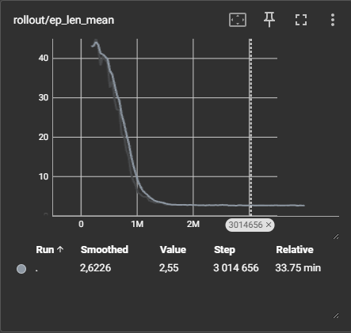
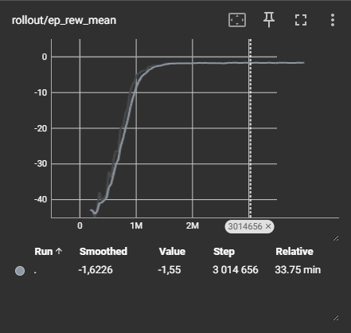
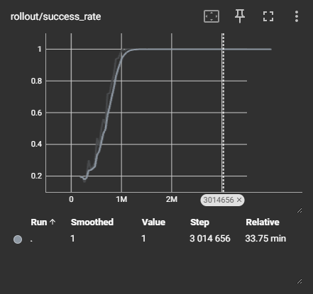
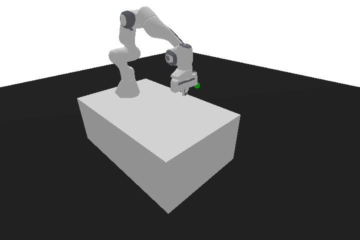
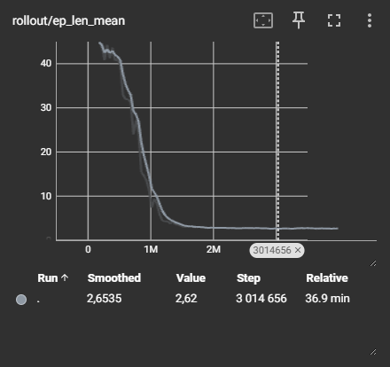
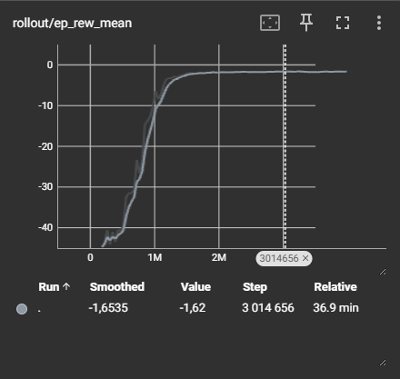
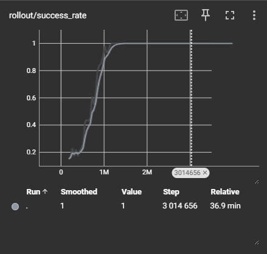
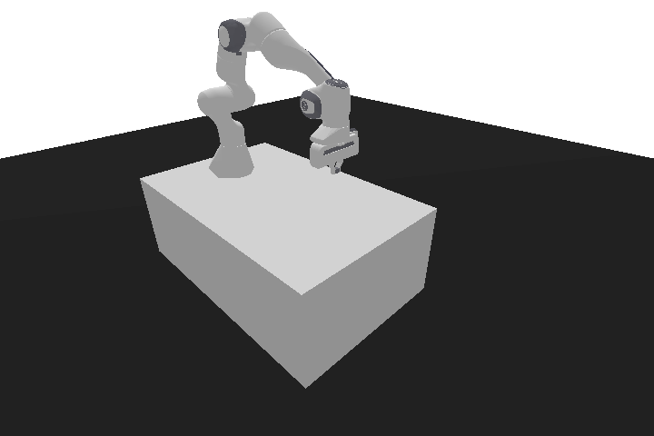

# Research on the Application of the Proximal Policy Optimization (PPO) Algorithm for Manipulator Robot Control under Uncertainty  

This work explores the application of the reinforcement learning method  
**Proximal Policy Optimization (PPO)** for controlling a manipulator robot  
under conditions of partial environmental uncertainty.  

**The aim of the study** is to analyze the effectiveness of the PPO algorithm in solving  
tasks of stabilization and precise positioning of the manipulator.  

The main task considered is the **PandaReach-v3** scenario:  
the manipulator robot must touch the target point with its gripper.  

Within the scope of the study, the following is planned:  
- development and testing of the model;  
- conducting experiments in a simulated environment;  
- evaluation of control quality using convergence and stability metrics.  

---  

# Theoretical Part  

## Problem Overview  
Controlling manipulator robots under **uncertainty** involves several challenges:  
- the robot dynamics may be partially unknown;  
- sensor noise and disturbances exist in the environment;  
- the target task (e.g., stabilization or positioning) requires high precision.  

Traditional control methods (based on inverse kinematics and dynamics equations) scale poorly and require accurate models.  
Reinforcement Learning (RL) methods allow training a control policy directly through interaction with a simulation or a real environment.  

## Key Concepts  

- **Reinforcement Learning (RL)** — the agent interacts with the environment, learning a policy $\pi(a|s)$ that maximizes the expected reward.  
- **Proximal Policy Optimization (PPO)** — an algorithm from the Policy Gradient family.  
  - based on optimizing a *surrogate objective* with a constraint on the update step;  
  - uses *clipping* to stabilize training;  
  - works well on continuous action spaces (e.g., joint angle control).  
- **Manipulator** — a multi-link robot with a large number of degrees of freedom (DoF). Control involves choosing control signals $a_t$ (torques, angles, velocities) to achieve goals in the workspace.  

## Mathematical Foundation  

The goal of PPO is to maximize the objective function:  

$$
L^{CLIP}(\theta) =
\mathbb{E}_t \Big[ \min\big(r_t(\theta) \hat{A}_t,
\text{clip}(r_t(\theta), 1 - \epsilon, 1 + \epsilon)\hat{A}_t \big) \Big]
$$  

where:  
- $r_t(\theta) = \frac{\pi_\theta(a_t|s_t)}{\pi_{\theta_{old}}(a_t|s_t)}$ — action probability ratio (importance sampling);  
- $\hat{A}_t$ — generalized advantage estimator (GAE);  
- $\epsilon$ — clipping hyperparameter, typically $0.1 \dots 0.3$.  

Critic update (state value estimation):  

$$
L^{V}(\theta_v) = \mathbb{E}_t \Big[ \big(V_{\theta_v}(s_t) - V_t^{target}\big)^2 \Big]
$$  

where $V_t^{target} = r_t + \gamma V(s_{t+1})$.  

The reward function for a manipulator typically includes:  
- penalty for deviation from the target position,  
- penalty for collisions and constraint violations,  
- bonus for successfully reaching the goal.

---

# Training the Base Model  

The base PPO model was trained in the **PandaReach-v3** environment with 16 parallel workers.  
Training was performed for **3 million timesteps**, divided into 10 iterations with checkpoint saving.  

Key hyperparameters:  
- Algorithm: **PPO (Proximal Policy Optimization)**  
- Learning rate: `3e-4`  
- Discount factor: `γ = 0.98`  
- Batch size: `512`  
- Steps per rollout: `2048`  
- Clipping range: `0.15`  
- Parallel environments: `16`  

## Metrics (Clean Environment)

### Episode Length
The average episode length quickly dropped from ~40 steps to ~2–3 steps,  
indicating that the agent learned to reach the goal efficiently.

---

### Average Reward
The reward increased from –40 at the start to around –1.5 after 1M timesteps,  
stabilizing as the agent’s performance improved.

---

### Success Rate
The success rate grew from ~0.2 (random successes) to 1.0 by 1M timesteps,  
showing the agent reliably solved the task in nearly all episodes.

## Checking the Base Model  

Below is an animation of the trained PPO agent in the **clean environment (PandaReach-v3)**:  

As can be seen, the PPO algorithm successfully completed the **PandaReach-v3** task: the agent reached maximum success (1.0) in about **1 million steps**.

# Training the Uncertainty Model  

To evaluate PPO under more realistic conditions, we introduced **uncertainty** into the environment:  

- **Noise in observations (sensor uncertainty):** Gaussian noise with $\sigma = 0.01$ was added to the state vector.  
- **Noise in actions (actuator inaccuracy):** Gaussian noise with $\sigma = 0.02$ was added to the control signals.  

This simulates imperfect sensors and actuators, making the task more challenging.  
Training was performed for **3 million timesteps** with the same hyperparameters as in the clean environment.  

---

## Metrics (Uncertainty Environment)

### Episode Length
Episodes gradually shortened from ~40 to ~2–3 steps,  
showing the agent still learned to achieve the goal efficiently despite noise.

---

### Average Reward
Rewards started at –40 and steadily increased,  
reaching near-optimal values around step 1M and then stabilizing close to 0.

---

### Success Rate
The success rate increased from ~0.2 to 1.0 by ~1M timesteps,  
demonstrating robustness of PPO to added uncertainty.

---

## Checking the Uncertainty Model  

Below is an animation of the trained PPO agent in the **uncertainty environment (PandaReach-v3 with noise)**:  

As can be seen, even under noisy observations and actions,  
the PPO algorithm consistently solved the task and reached **100% success**.

# Conclusions
- PPO successfully solves the **PandaReach-v3** task even with added noise in observations and actions.  
- Compared to the clean environment, **training is slightly slower**: success is reached around 0.8–1.0M steps (in the clean setup, plateau appeared earlier).  
- The model shows **robustness to moderate uncertainty**, making PPO a suitable baseline for such tasks.  
